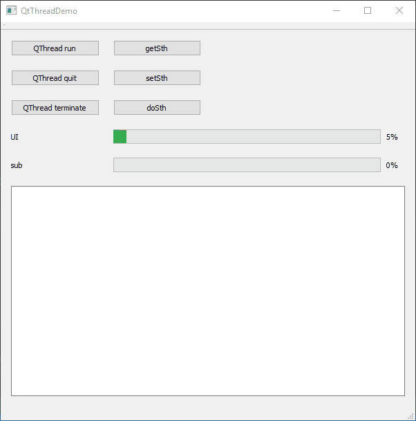

这两天在弄Qt的多线程，简要记录一些心得。

## ref

- [Qt使用多线程的一些心得——1.继承QThread的多线程使用方法 CSDN](https://blog.csdn.net/czyt1988/article/details/64441443) 写得还是挺不错的，比较实用
- [Qt使用多线程的一些心得——2.继承QObject的多线程使用方法 CSDN](https://blog.csdn.net/czyt1988/article/details/71194457)

## 简述

Qt有两种多线程方法，一种是继承QThread的run函数，另一种是把继承于QObject的类转移到新的Thread里。Qt4.8一般采用继承QThread的方法，但在4.8之后官方建议采用第二种方法，使用会更加灵活一些。
网络上较多的方法是采用第一种，包括很多书籍教程也是，这里把两种方法都进行下记录。

通常，应用程序都是在一个线程中执行的，但当调用一个好事操作，例如大批量Io或大量矩阵变换等CPU密集操作时，用于界面常常会冻结，可以使用多线程来解决这些问题。

优势

1. 提高应用程序的响应速度，尤其对于GUI来说，如果某个操作耗时很长，整个系统都在等待，将不能响应鼠标、键盘、菜单等操作。利用多线程可以将耗时操作放到一个新的线程中，避免该问题。
2. 使多CPU更加有效
3. 改善程序结构，将复杂的进行拆成多个线程，成为独立或半独立的运行部分，有利于代码的理解和维护。

不足

1. 行为无法预期，多次执行结果可能不尽相同
2. 多线程的执行顺序无法保证，与操作系统地调度策略和线程优先级有关
3. 多线程的切换可能发生在任何时间和地点
4. 对代码的敏感度较高，细微修改都可能造成意向不到的结果

### 继承QThread

使用Qthread时有一个重要的规则，**QThread只有run函数是在新线程里的，其他所有函数都在QThread生成的线程里**。之前某个写法一直阻塞UI就是因为我在前天函数进行了操作，但其他函数并不是在子线程中的。所以要注意以下两点：

1. 如果QThread是在ui所在线程里成成，那么QThread的其他非run函数都是和ui一样的，要确保耗时的操作都在run函数中完成。
在UI线程下调用QThread的非run函数和执行普通函数没有区别。但要注意，如果这2. 个函数对线程的某个变量进行变更，并且该变量在run函数中也会使用，就要注意同步的问题，因为虽然都是QThread的类里，但run和非run函数实际上两个不同线程进行的，之间可能有竞争。

任何继承于QThread的线程都是通过继承QThread的run函数来实现多线程的，因此，必须重写QThread的run函数，把复杂逻辑写在QThread的run函数中。

参考博客提供的代码，如下，稍微替换了下命名风格。该类继承自QThread，包含了Qt类的常见内容，包括普通方法，信号和槽，还有run函数。其中`SetSth, GetSth, DoSth`函数都进行了500ms的延迟，用于验证在`QThread::run()`之外调用QThread的成员函数并会在新的线程中运行。

**ThreadFromQThread.h**

```C++
#pragma once

#include <QThread>
#include <QMutex>

class ThreadFromQThread : public QThread {
    Q_OBJECT

signals:
    void Msg(const QString& info);
    void Progress(int present);

public:
    ThreadFromQThread(QObject* par);
    ~ThreadFromQThread();
    void SetSth();
    void GetSth();
    void Set_runCnt(int count);
    void run();
    void DoSth();
private:
    int runCnt_;
    QMutex mutex_;
    bool canRun_;

    public slots:
    void StopImmediately();
};


```

**ThreadFromQThread.cpp**

```C++
#include "ThreadFromQThread.h"
#include <QDebug>
#include <QMutex>
ThreadFromQThread::ThreadFromQThread(QObject* par) : QThread(par)
, runCnt_(20) {
}

ThreadFromQThread::~ThreadFromQThread() {
    qDebug() << "ThreadFromQThread::~ThreadFromQThread()";
}

void ThreadFromQThread::SetSth() {
    msleep(500);
    QString str = QString("%1->%2,thread id:%3").arg(__FUNCTION__).arg(__FILE__).arg((int)QThread::currentThreadId());
    emit Msg(str);
}

void ThreadFromQThread::GetSth() {
    msleep(500);
    emit Msg(QString("%1->%2,thread id:%3").arg(__FUNCTION__).arg(__FILE__).arg((int)QThread::currentThreadId()));
}

void ThreadFromQThread::Set_runCnt(int count) {
    runCnt_ = count;
    emit Msg(QString("%1->%2,thread id:%3").arg(__FUNCTION__).arg(__FILE__).arg((int)QThread::currentThreadId()));
}

void ThreadFromQThread::run() {
    int cnt = 0;
    QString str = QString("%1->%2,thread id:%3").arg(__FILE__).arg(__FUNCTION__).arg((int)QThread::currentThreadId());
    emit Msg(str);
    while (1) {
        sleep(1); // 共20秒完成一次进度条，不过doSth还会暂停一点时间
        ++cnt;
        emit Progress(((float)cnt / runCnt_) * 100);
        emit Msg(QString("ThreadFromQThread::run times:%1").arg(cnt));
        DoSth();
        if (runCnt_ == cnt) {
            break;
        }
        {
            QMutexLocker locker(&mutex_);
            if (!canRun_)
                return;
        }
    }
}

void ThreadFromQThread::DoSth() {
    msleep(500);
    emit Msg(QString("%1->%2,thread id:%3").arg(__FUNCTION__).arg(__FILE__).arg((int)QThread::currentThreadId()));
}

void ThreadFromQThread::StopImmediately() {
    QMutexLocker locker(&mutex_);
    canRun_ = false;
}
```

博主提供了如下的UI界面，用于验证：
1. UI线程中调用SetSth和GetSth，是否会阻塞UI线程
2. 调用quit函数和exit是否会停止子线程
3. 调用terminte是否会停止子线程

基本效果如下


UI界面上提供一个进度条，由主程序的定时器控制，每100ms触发一次，用于证明UI线程是否阻塞。
第二个进度条由子线程控制。
run按钮会运行子线程。
点击getSth, setSth, doSth等按钮时候，都是调用子线程类中的非run函数，可以看到对应的thread ID其实并不是子线程的ID。
并且点击quit，thread没有任何响应，QThread在不调用exec()的情况下的exit和quit函数不会起作用。
点击terminate按钮，线程立即终止。

总结一下：

1. 正确终止子线程
   在子线程类中添加bool变量，主线程修改该变量然后在线程的run函数中判断是否退出。注意要用QMutexLocker枷锁判断，避免线程冲突。
2. 正确启动线程
   1. 全局线程
        方法一：在窗口中创建，在窗口析构时要先调用线程的wait函数，等待子线程完全结束
        方法二：创建时连接`connect(thread, &QThread::finished, &QObject::deleteLater;`，父对象为`NULL`，在线程结束时自行销毁（消息循环中确认没有该对象后析构）
   2. 局部线程
        采用以上方法二即可
3. 重复创建子线程时，可能要注意重复生成还有析构，以及时切换到新线程中完成任务，参考代码。

### 继承QObject

Qt官方比较推荐继承QObject的方法来实现，更加灵活。
QObject是Qt框架的基本类，但凡涉及到信号槽有关的类都是继承于QObject。QObject是一个功能异常强大的类，它提供了Qt关键技术信号和槽的支持以及事件系统的支持，同时它提供了线程操作的接口，也就是QObject是可以选择不同的线程里执行的。
QObject的线程转移函数是：void moveToThread(QThread * targetThread) ，通过此函数可以把一个顶层Object（就是没有父级）转移到一个新的线程里。
QThread非常容易被新手误用，主要是QThread自身并不生存在它run函数所在的线程，而是生存在旧的线程中，此问题在上一篇重点描述了。由于QThread的这个特性，导致在调用QThread的非run函数容易在旧线程中执行。

