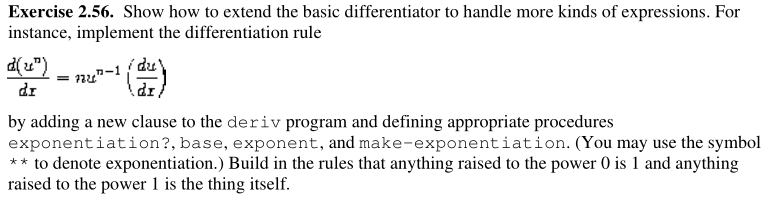

## 2.3 Symbolic Data

### 2.3.1 Quotation
本小结主要讲符号的引用，之前都是在对数字进行处理，现在要考虑对实际变量的处理。

`eq?`可以用于判断两个符号的是否相等。
从而可以定义`memq`，用于判断给定符号是否在特定list中，如果不是返回nil，否则返回以该符号为首的sublist。

```lisp
(define (memq item x)
    (cond ((null? x) false)
          ((eq? item (car x)) x)
          (else (memq item (cdr x)))))
```

### 2.3.2 Example:Symbol Differentiation

本节用求微分举例，这种带符号的求导与抽象数据的处理不同，是带符号的。只利用了最简单的4个求导规则

$$
\begin{aligned}
& \frac{\mathrm{d}c}{\mathrm{d}x} = 0 \\[2ex]
& \frac{\mathrm{d}x}{\mathrm{d}x} = 1 \\[2ex]
& \frac{\mathrm{d}(u + v)}{\mathrm{d}x} = \frac{\mathrm{d}u}{\mathrm{d}x} + \frac{\mathrm{d}v}{\mathrm{d}x} \\[2ex]
& \frac{\mathrm{d}(uv)}{\mathrm{d}x} = u\frac{\mathrm{d}u}{\mathrm{d}x} + v\frac{\mathrm{d}u}{\mathrm{d}x} \\[2ex]
\end{aligned}
$$

首先定义如下基本操作
```lisp
(define (variable? e)
    (symbol? x))

(define (same-variable? v1 v2)
    (and (varaible? v1) (variable? v2) (eq? v1 v2)))

(define (make-sum a1 a2)
    (list '+ a1 a2))

(define (make-product m1 m2)
    (list '* m1 m2))

(define (sum? x)
    (and (pair? x) (eq? (car x) '+)))

(define (addend s)
    (cadr s))

(define (augend s)
    (caddr s))   ; 注意s是个list，所以要取caddr而不是cddr

(define (product? x)
    (and (pair? x) (eq? (car x) '+)))

(define (multiplier p)
    (cadr p))

(define (multiplicand p)
    (caddr p))
```

随后就可以根据定义的求导法则递归展开

```lisp
(define (deriv exp var)
    (cond ((number? exp) 0)
          ((variable? exp)
            (if (same-variable? exp var) 1 0)
          ((sum? exp)
            (make-sum (deriv (addend exp) var)
                      (deriv (augend exp) var))
          ((product? exp)
            (make-product (deriv (multiplier exp) var)
                          (deriv (multiplicand exp) var)))))
          (else (error "unknown expression type -- DERIV" exp))))
```


以上会出现一个问题，就是并没有化简到最简单，比如

```lisp
(define '(+ x 3) 'x)
```

的结果显示为
```lisp
(+ 1 0)
```

解决这个问题在于改变`make-sum`的行为即可，`deriv`不用改变。
```
(define (make-sum a1 a2)
    (cond ((=number? a1 0) a2)
          ((=number? a2 0) a1)
          ((and (number? a1) (number? a2)) (+ a1 a2))
          (else (list '+ a1 a2))))


(define (make-product m1 m1)
    (cond ((or (=number? m1 0) (=number? m2 0)) 0)
          ((=number? m1 1) m2)
          ((=number? m2 1) m1)
          ((and (number? m1) (number? m2)) (* m1 m2))
          (else (list '* m1 m2))))
```

习题2.56 实现多项式求导规则

```lisp
(define (deriv exp var)
    (cond ((number? exp) 0)
          ((variable? exp)
            (if (same-variable? exp var) 1 0)
          ((sum? exp)
            (make-sum (deriv (addend exp) var)
                      (deriv (augend exp) var))
          ((product? exp)
            (make-product (deriv (multiplier exp) var)
                          (deriv (multiplicand exp) var)))))
          ((exponentiation? exp)
            (let ((n (exponent exp))
                  (u (base exp)))
                  (make-product
                    n
                    (make-product (make-exponentiation u (- n 1))
                                  (deriv u var)))))
          (else (error "unknown expression type -- DERIV" exp))))

(define (make-exmponentiation base exponent)
    (cond ((= exponent 0)
            1)
          ((= exponent 1)
            base)
          (else
            (list '** base exponent))))
```