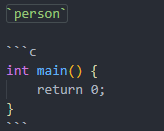

<!-- # VSCode支持的markdown语法参考 -->

主要记录下载使用vscode的markdown记录时，一些参考备注，可能集中在公式的支持上面。主要来源于参考资料，自己重新记录一遍便于回溯。

---

## 1. 参考资料与备注

1. 主要参考资料[VsCode支持的markdown语法参考](https://www.jianshu.com/p/fd761fc43753)
2. Markdown PDF没有办法解决$\LaTeX$公式的渲染问题，暂时只能使用Markdown Preview Enhance来导出到html再另存为pdf格式。
3. Markdown Preview Enhance也是可以配置css文件的。
4. Markdown Preview Enhance可以配置多种流程图，但是渲染等需要再研究下。
5. 关于$\LaTeX$公式是需要Markdown Math插件的，至于公式的许多用法请参考其他问题。
6. 在公式环境中，不要轻易分行，容易导致公式渲染失败。
7. 其他关于markdown渲染的问题，参考**hexo使用小记**。
8. [GitHub Flavored Markdown Spec](https://github.github.com/gfm/)

## 2. 文本部分

### 2.1. 粗体、斜体和删除线

**这是粗体**

*这是斜体*

~~这是删除线~~

```text
**这是粗体**
*这是斜体*
~~这是删除线~~
```

### 2.2. 分级标题

支持类似于HTM标签的标题，例如

<!-- > 这是一级标题
> === 
> 
> 这是二级标题
> --- 
> 
> # 这是一级标题
> ## 这是二级标题
> ### 这是三级标题 -->
```

这是一级标题
===

这是二级标题
---

# 这是一级标题
## 这是二级标题
### 这是三级标题

```

### 2.3. 标注

好像支持不了尾注和简单的上下标写法

- 上标：30<sup>test</sup>

- 下标：30<sub>test</sub>

```text
- 上标：30<sup>test</sup>
- 下标：30<sub>test</sub>
```

### 2.4. 文字引用

在引用的文字前面加`>`即可，并且可以嵌套

> 这是引用

```text
> 这是引用
```

### 2.5. 生成目录

需要使用Markdown TOC插件，不过这个插件可能会有问题，参考

- [VSCode如何为Markdown自动生成目录](https://jingyan.baidu.com/article/60ccbceba8d4f464cbb19740.html)

- [VSCode中Markdown目录显示异常](https://jingyan.baidu.com/article/6b97984df62b501ca3b0bf7a.html)

### 2.6. 标签分类代码图像

### 2.7. 分类

好像不支持这个功能

### 2.8. 列表

支持有序列表和无序列表两种，无序列表用`-+*`都可以，无序和有序列表都要注意后面需要有一个空格。列表也可以嵌套，缩进3个空格即可。

- 无序列表1
- 无序列表2
- 无序列表3
- 无序列表4

```text
- 无序列表1
- 无序列表2
- 无序列表3
- 无序列表4
```

1. 有序列表项
2. 有序列表项
3. 有序列表项

```text
1. 有序列表项
2. 有序列表项
3. 有序列表项
```

### 2.9. 超链接

用如下语法支持超链接，可以在括号中再添加字符串来给超链接加标题.

[百度一下，你就知道](www.baidu.com "给百度链接加标题")
[百度一下，你就知道](www.baidu.com)

```text
[百度一下，你就知道](www.baidu.com "给百度链接加标题")
[百度一下，你就知道](www.baidu.com)
```

### 2.10. 代码



### 2.11. 图像

> 

```text
使用  插入图像。
```

### 2.12. 表格

可以使用`:`来对齐，左边加`:`表示文字居左；两边加`:`表示文字居中；右边的表示右对齐。
这里好像不支持`>`的跨表格功能。

| Item     | Value     | Qty   |
| :------- | --------: | :---: |
| Computer | 1600 USD  | 5     |
| Phone    | 12 USD    | 12    |
| Pipe     | 1 USD     | 234   |

```text
| Item     | Value     | Qty   |
| :------- | --------: | :---: |
| Computer | 1600 USD  | 5     |
| Phone    | 12 USD    | 12    |
| Pipe     | 1 USD     | 234   |
```

### 2.13. TODO事项

注意方括号中间有空格，站点的渲染引擎暂不支持。

- [ ] 要做的事情
- [x] 已经做的事情

```text
- [ ] 要做的事情
- [x] 已经做的事情

```

## 3. 数学公式与Latex

用`$`表示行内公式，例如 $a^2+b^2=c^2$

用`$$`表示整行公式，例如
$$a^2+b^2=c^2 $$

```text
用`$`表示行内公式，例如$a^2+b^2=c^2$

用`$$`表示整行公式，例如
$$
a^2+b^2=c^2
$$
```

这一块参考文档**一份不太简短的$\LaTeX$介绍**比较好，这里仅仅列可能会常用的模板或者不太容易找到的用法。

特殊符号
$$
\int \prod \sum \lim_{x \to x} \sin x  \times \infty \equiv \approx \sim \log 2 \lg 5  
$$

```text
\int \prod \sum \lim_{x \to x} \sin x  \times \infty \equiv \approx \sim \log 2 \lg 5  
```

$$
\land \lor \lnot \lt \gt \le \ge = \neq
$$

```text
\land \lor \lnot \lt \gt \le \ge = \neq
```

$$
a \equiv b \pmod n
$$

```text
a \equiv b \pmod n
```

$$
\vec x \hat x \dot x
$$

```text
\vec x \hat x \dot x
```

省略号
$$
a_1, a_2, \ldots, a_n \qquad a_1 + a_2 + \cdots a_n
$$

```text
a_1, a_2, \ldots, a_n \qquad a_1 + a_2 + \cdots a_n
```

矩阵
$$
\mathbf{X} = \left(
\begin{array}{cccc}
x_{11} & x_{12} & \ldots & x_{1n}\\
x_{21} & x_{22} & \ldots & x_{2n}\\
\vdots & \vdots & \ddots & \vdots\\
x_{n1} & x_{n2} & \ldots & x_{nn}\\
\end{array} \right)
$$

```text
\mathbf{X} = \left(
\begin{array}{cccc}
x_{11} & x_{12} & \ldots & x_{1n}\\
x_{21} & x_{22} & \ldots & x_{2n}\\
\vdots & \vdots & \ddots & \vdots\\
x_{n1} & x_{n2} & \ldots & x_{nn}\\
\end{array} \right)
```

$$
\mathbf{H}=
\begin{bmatrix}
\dfrac{\partial^2 f}{\partial x^2} &
\dfrac{\partial^2 f}
{\partial x \partial y} \\[8pt]
\dfrac{\partial^2 f}
{\partial x \partial y} &
\dfrac{\partial^2 f}{\partial y^2}
\end{bmatrix}
$$

```text
\mathbf{H}=
\begin{bmatrix}
\dfrac{\partial^2 f}{\partial x^2} &
\dfrac{\partial^2 f}
{\partial x \partial y} \\[8pt]
\dfrac{\partial^2 f}
{\partial x \partial y} &
\dfrac{\partial^2 f}{\partial y^2}
\end{bmatrix}
```

$$
\begin{pmatrix}
1 & 2 \\
1 & 2 \\
\end{pmatrix}
\begin{bmatrix}
1 & 2 \\
1 & 2 \\
\end{bmatrix}
\begin{Bmatrix}
1 & 2 \\
1 & 2 \\
\end{Bmatrix}
\begin{vmatrix}
1 & 2 \\
1 & 2 \\
\end{vmatrix}
\begin{Vmatrix}
1 & 2 \\
1 & 2 \\
\end{Vmatrix}
$$

```text
\begin{pmatrix}
1 & 2 \\
1 & 2 \\
\end{pmatrix}
\begin{bmatrix}
1 & 2 \\
1 & 2 \\
\end{bmatrix}
\begin{Bmatrix}
1 & 2 \\
1 & 2 \\
\end{Bmatrix}
\begin{vmatrix}
1 & 2 \\
1 & 2 \\
\end{vmatrix}
\begin{Vmatrix}
1 & 2 \\
1 & 2 \\
\end{Vmatrix}
```

多行公式
$$
\begin{aligned}
a + b &= c \\
a &= c - b \\
0 &= c - b - a
\end{aligned}
$$


```text
\begin{aligned}
a + b &= c \\
a &= c - b \\
0 &= c - b - a
\end{aligned}
```

间距
$$
a \quad b \qquad cd \quad c \, d \quad c \: d \quad c \; d
$$

```text
a \quad b \qquad cd \quad c \, d \quad c \: d \quad c \; d
```

微积分求导符号
$$
\int_a^b f(x)\mathrm{d}x
\qquad
\int_a^b f(x)\,\mathrm{d}x
\qquad
\dfrac{\partial^2 f}{\partial x^2}
$$

```text
\int_a^b f(x)\mathrm{d}x
\qquad
\int_a^b f(x)\,\mathrm{d}x
\qquad
\dfrac{\partial^2 f}{\partial x^2}
```

分段函数
$$
 |x| =
\begin{cases}
-x & \text{if } x < 0,\\
0 & \text{if } x = 0,\\
x & \text{if } x > 0.
\end{cases}
$$

```text
 |x| =
\begin{cases}
-x & \text{if } x < 0,\\
0 & \text{if } x = 0,\\
x & \text{if } x > 0.
\end{cases}
```

字体
MathJax不支持`\bm`
$$
\mathbf{d} x
\qquad \mathbf{\mu, M}
\qquad \boldsymbol{\mu, M}
$$

```text
\mathbf{d} x
\qquad \mathbf{\mu, M}
\qquad \boldsymbol{\mu, M}
```

括号手动调整
$$
\bigg \{\Bigl\langle \bigl( (x) \bigr ) \Bigr \rangle \bigg \}
$$

```text
\bigg \{\Bigl\langle \bigl( (x) \bigr ) \Bigr \rangle \bigg \}
```

括号自适应调整
$$
\left( \frac12 \right)
(\frac 1 2)
$$

```text
\left( \frac12 \right)
(\frac 1 2)
```

编号与标签
$$
E=mc^2 \tag{tag}
$$

```text
E=mc^2 \tag{tag}
```

行间距
$$
\begin{aligned}
\sum_1^n i^2 \\[5ex]
\frac12 \\[2ex]
\frac {x^2}{y}
\end{aligned}
$$

```text
\begin{aligned}
\sum_1^n i^2 \\[5ex]
\frac12 \\[2ex]
\frac {x^2}{y}
\end{aligned}
```

颜色
$$
\color{black}{blackText} \color{yellow}{yellowText}
$$

```text
\color{black}{blackText} \color{yellow}{yellowText}
```

## 4. 流程图

这一小节需要插件支持，而且渲染的时候需要定义格式，暂时不弄

## 5. 转义字符

md支持下列字符的转义

\\ 反斜杠
\` 反引号
\* 星号
\_ 下划线
\{\} 大括号
\[\] 中括号
\(\) 小括号
\# 井号
\+ 加号
\- 减号
\. 英文句号
\! 感叹号

```text
\\ 反斜杠
\` 反引号
\* 星号
\_ 下划线
\{\} 大括号
\[\] 中括号
\(\) 小括号
\# 井号
\+ 加号
\- 减号
\. 英文句号
\! 感叹号
```