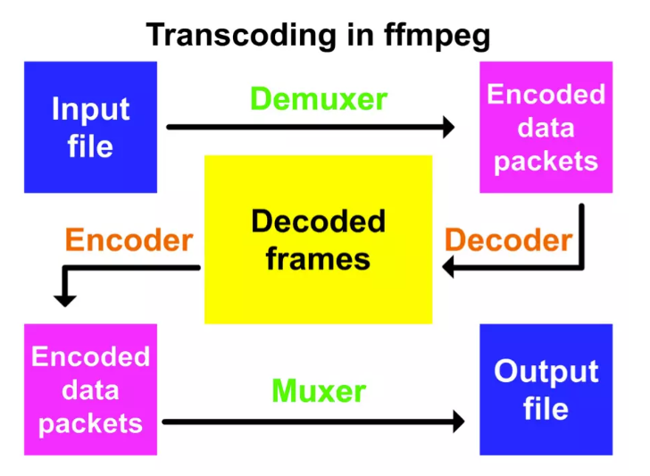
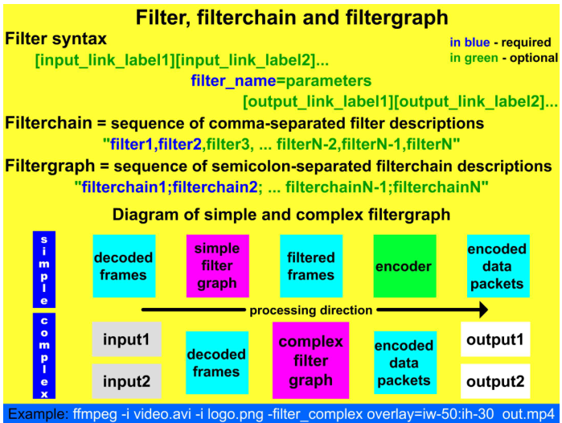

在工作中还是挺经常用到ffmpeg的，虽然多用于编解码和一些格式的转换，但很多时候确实需要用到一些特殊的用法，网络上比较少能查找到。顺便准备稍微系统学习一下ffmpeg知识，便于扩展和应用，没准自己有时候还要做一些定制化的处理。例如用NVIDIA加速的HDR10编解码、V210格式的编解码、加标签和文字用于demo、视频的裁剪和拼接。

---

# ref
- [FFmpeg Basics](http://ffmpeg.tv/) 前期的计划准备以这本书展开，作为基础的巩固
- [《FFmpeg Basics》中文版-目录](https://www.jianshu.com/p/5baf47e7c4cb) 上一本书的中文翻译，初步看起来还可以，预计很多内容都来自这篇blog
- [An ffmpeg and SDL Tutorial or How to Write a Video Player in Less Than 1000 Lines](http://dranger.com/ffmpeg/ffmpeg.html) 用ffmpeg写个播放器，后期参考
- [A FFmpeg Tutorial For Beginners](http://keycorner.org/pub/text/doc/ffmpeg-tutorial.htm) 官网的一些简单介绍
- [Tutorial_FFMPEG](https://wenku.baidu.com/view/da6b71f04128915f804d2b160b4e767f5acf80d5.html) 一个很简单的官网介绍，十一页

# FFmpeg Basics的目录

1. 简介
2. FFmpeg基本介绍
3. 帮助和特征信息
4. 比特率/帧率/文件大小
5. 调整和伸缩视频
6. 裁剪视频
7. 填充视频
8. 翻转和旋转视频
9. 模糊/锐化和其他去噪
10. overlay-画中画
11. 为视频添加文字
12. 格式间转换
13. 时间操作
14. 数学函数
15. 元数据和字幕
16. 图像处理
17. 数字音频
18. 预设编解码器
19. 视频的隔行扫描
20. FFmpeg组件和项目
21. 麦克风和摄像头
22. 批处理文件
23. 颜色修正
24. 先进的技术点
25. 网页视频
26. 调试和测试
27. 词汇表/关于作者的介绍

这本书主要是介绍调整大小、裁剪、填充、去燥和覆盖等基本的视频编辑功能，还包括一些复杂的处理和实验的指导内容。

# ffmpeg的基本介绍
> FFmpeg是根据GNU通用公共许可证获得许可的多媒体处理自由软件项目的名称。 该项目最受欢迎的部分是用于视频和音频编码/解码的ffmpeg命令行工具，其主要特点是速度快，输出质量高和文件大小比较小。 FFmpeg中的“FF”表示 媒体播放器上的表示“快进”的控制按钮，“mpeg”是Moving Pictures Experts Group的缩写。 FFmpeg标志包含Z形图案，这是图片中以8x8块图示的熵编码方案的特征。

ffmpeg命令行工具组件，我一般常用ffmpeg和ffprobe

| | |
------- | -------
ffmpeg | 快速音频和视频编码器/解码器
ffplay | 媒体播放器
ffprobe | 显示媒体文件的特点
ffserver | 使用HTTP和RTSP协议进行多媒体流的广播服务器

ffmpeg软件库，可以参考github的介绍
| | |
------- | -------
libavcodec | 各种多媒体编解码器的软件库
libavdevice | 软件库的设备，提供了访问捕获和播放设备的一层抽象
libavfilter | 提供了通过一系列滤波去来更改解码后的音视频的手段
libavformat | 实现了流协议、容器格式和基本的IO操作
libavutil | 包含各种实用程序的软件库
libpostproc | 用于后期处理的软件库
libswresample | 用于音频重采样的软件库
libswscale | 用于媒体扩展的软件库

其中音频的编解码库libavcodec最常用，libavfilter也挺常用，用于不同YUV格式之间的转换、缩放等等的，都需要用滤波实现。

以上组件都是用C语言完成的，源码可以在Windows、Linux和Mac OS X上编译使用。

# ffmpeg下载
- [Download FFmpeg](http://ffmpeg.org/download.html) 主要下载地址
- [FFmpeg Builds](https://ffmpeg.zeranoe.com/builds/) windows可以直接下载别人编译好的可执行文件，其实就是上面提供的路径

# ffmpeg的基本语法格式

cmd的环境变量设置
```bat
set path=%path%;C:/media
```

# 使用ffplay预览

如果用ffmpeg会需要保存到一个文件中，但用ffplay则可以直接预览看效果，用法差不多只是不用再指定输出文件

# 在ffmpeg中使用si前缀

其实就是用m, k, g等代替千位符号等等的


# ffmpeg中的转码

其实就是demuxer和decoder


# 滤波器
在多媒体处理中，滤波器通常指将编码前对输入文件进行修改的软件。ffmpeg中有多种内置的滤波器，可以通过复杂的语法直接连接，避免了多次编解码产生的PQ下降。libavfilter是ffmpeg的filtering API，可以使用`-vf`和`-af`进行处理

```
ffmpeg -i A.flv -vf hqdn3d,pad=2*iw output.mp4  # 先滤波降噪并填充变成3840x1080
ffmpeg -i output.mp4 -i A.flv -filter_complex overlay=w compare.mp4     # 填充另一个视频

# 上面等价于
ffplay -i A.flv -vf split[a][b];[a]pad=2*iw[A];[b]hqdn3d[B];[A][B]overlay=w # 直接使用filtergraph完成两路视频不同的处理并拼接
```

利用filtergraphs可以同时完成多路的滤波，实现比filter更复杂一些操作，如下是滤波器的典型用法


