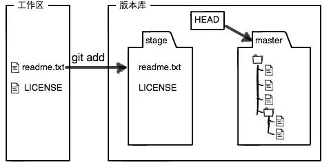

- [gitNotes_from_Liao](https://github.com/hongiii/gitNotes_from_Liao)
- [廖雪峰的Git教程](https://www.liaoxuefeng.com/wiki/0013739516305929606dd18361248578c67b8067c8c017b000)

记录git使用过程的一些问题和方法。

## 集中式VS分布式版本控制系统

集中式版本管理系统，版本库是集中在中央服务器的，需要先从中央服务器同步下来，然后再推送回去，因此必须联网才能工作。而分布式版本控制系统则没有中央服务器，每个人的电脑上都是一个完整的版本库，因此工作的时候不需要联网，需要协作的时候只需要将相互的修改推动给对方，互相就可以看到修改了。
因此两者之间的历史版本维护位置不同，Git本地库包含了代码库还有历史库，在本地就可以记录历史，而SVN的历史库位于中央仓库，每次对比和提交代码都必须链接到中央库。
由于每个人的电脑都有完整的版本库，因此其安全性很高，某一个人的电脑坏了无关紧要。当然实际使用的时候，很少是是两个人之间的进行版本库的推送，一般也有一台机器充当中央服务器，该服务器的作用仅仅是用来方便大家之间的交流。


## 本地和远程同步

本地库要推送到远端，但这两个git库不相关，例如已有本地库，然后github上又新建了项目

- [上传本地项目到github远程仓库](https://blog.csdn.net/guotingting923/article/details/80162896)
- [git 出现 fatal: refusing to merge unrelated histories 错误](https://www.centos.bz/2018/03/git-%E5%87%BA%E7%8E%B0-fatal-refusing-to-merge-unrelated-histories-%E9%94%99%E8%AF%AF/)
- [GitHub使用部分--本地库和远程库之间的同步](https://www.jianshu.com/p/71e8dbd14b30)

方法一
可以先将远程库拉下来，然后再将本地的代码拷贝到远端库下载到本地库，然后在提交，这样相当于一次update。不过这样子不能记录原有的git记录

方法二
强制关联推送

```sh
# 本地先正常init、add和commit

# 关联远程库
$ git remote add origin https://github.com/AstrayWu/utils_python.git

# 如果远端库已经存在，则进行删除再关联
$ git remote rm origin

# 使用--allow-unrelated-hisotries进行强制关联
$ git pull origin master --allow-unrelated-hisotries

$ git push -u origin master
```

## git push

- [git push命令 - 易百教程](https://www.yiibai.com/git/git_push.html) 
- [2.5 Git 基础 - 远程仓库的使用](https://git-scm.com/book/zh/v2/Git-%E5%9F%BA%E7%A1%80-%E8%BF%9C%E7%A8%8B%E4%BB%93%E5%BA%93%E7%9A%84%E4%BD%BF%E7%94%A8)
- [Git push 常见用法](https://www.cnblogs.com/qianqiannian/p/6008140.html)

用`git remote`查看配置的远程库名字，一般`origin`是Git克隆的远程仓库服务器的默认名字。

```sh
$ git remote # 查看配置的远程库名字
$ git remote -v # 显示对应的URL
$ git remote add <shortname> <url> # 添加远程库并制定简称
$ git remote add pb https://github.com/paulboone/ticgit
$ git remote add pb git@github.com:paulboone/ticgit.git
$ git remote -v
$ git fetch [remote-name] # 有了简写后就可以用简写代替远程库的名字
$ git push [remote-name] [branch-name]
$ git push -u origin master 第一次同步时使用该命令
$ git push origin master
origin https://github.com/schacon/ticgit (fetch)
origin https://github.com/schacon/ticgit (push)
pb https://github.com/paulboone/ticgit (fetch)
pb https://github.com/paulboone/ticgit (push)
```

`git push`的用法为，冒号后面直接加远程分支名：

```sh
git push <远程主机名> <本地分支名>:<远程分支名>
```

如果省略本地分支名，则表示删除指定的远程分支，因为这等同于推送一个空的本地分支到远程分支。下面命令表示删除origin主机的master分支。

```sh
git push origin :master
# 等同于
git push origin --delete master
```

如果当前分支与多个主机存在追踪关系，则可以使用`-u`选项指定一个默认主机，这样后面就可以不加任何参数使用`git push`。下面命令将本地的master分支推送到origin主机，同时指定origin为默认主机，后面就可以不加任何参数使用`git push`了。

```sh
git push -u origin master
```

## 工作区、暂存区和版本库

工作区：在电脑里能看到的目录； 版本库：在工作区有一个隐藏目录.git，是Git的版本库。 Git的版本库中存了很多东西，其中最重要的就是称为stage（或者称为index）的暂存区，还有Git自动创建的master，以及指向master的指针HEAD。

进一步解释一些命令：
`git add`实际上是把文件添加到暂存区
`git commit`实际上是把暂存区的所有内容提交到当前分支

## git diff

查看修改内容

```sh
git diff # 可以查看工作区(work dict)和暂存区(stage)的区别
git diff --cached # 可以查看暂存区(stage)和分支(master)的区别
git diff HEAD -- <file> # 可以查看工作区和版本库里面最新版本的区别
```

## git log

查看提交日志

```sh
git log
git log --pretty=oneline # 简化日志输出信息
```

## git reflog

查看命令历史

```sh
git reflog
```

## git reset

- [Git Reset命令- 腾讯云](https://cloud.tencent.com/developer/article/1358036)

版本回退
返回上一个版本，在Git中，用`HEAD`表示当前版本，上一个版本就是`HEAD^`，上上一个版本是HEAD^^，往上100个版本写成`HEAD~100`。commit_id是版本号，是一个用SHA1计算出的序列

```sh
git reset --hard HEAD^
```

- `git reset --soft HEAD^`：将最近一次提交节点的提交记录回退到暂存区
- `git reset --mixed HEAD^`：将最近一次提交节点的提交记录回退到工作区
- `git reset --hard HEAD^`：将最近一次提交节点的提交记录全部清除

eg：
在Master分支中，首先通过`git add test.txt`将test.txt文件添加到暂存区，再通过`git commit -m "add file test.txt "`将暂存区的内容作为一次提交记录添加到提交区，最后如果没问题的话就可以通过`git push origin master`将这次提交push到远端仓库。

使用

1. 修改commit的message，有点类似`amend`操作
    如果此时发现提交记录的comment写错了，如将`git commit -m "add file test.txt"`写成了`git commit -m "ad file test.txt"`，那么就可以使用    `git reset --soft HEAD^`将本次提交回退到暂存区，再重新把comment补全，进行一次提交。

2. 修改commit的文件
   如果此时发现提交记录里有一个文件多提交了，或者有一个文件漏添加到暂存区而没有在此次提交内，则可以通过`git reset --mixed HEAD^`将本次提交都回退到没有添加到暂存区之前，然后再重新add需要提交的文件后，再重新add

3. 完全撤销此次commit
   如果此时发现修复一个BUG完全错了，希望取消这次提交，并且把代码回退到没有改动的话，则需要使用`git reset --hard HEAD^`，来将这次提交全部回退。


## 撤销修改

### 丢弃工作区的修改

该命令是指将文件在工作区的修改全部撤销，这里有两种情况：

1. file自修改后还没有被放到暂存区，现在，撤销修改就回到和版本库一模一样的状态；
2. file已经添加到暂存区后，又作了修改，现在，撤销修改就回到添加到暂存区后的状态。
总之，就是让这个文件回到最近一次git commit或git add时的状态。也就是将工作区的状态回退到暂存区或者版本库。

```sh
git checkout -- <file>
```

### 丢弃暂存区的修改

```sh
git reset HEAD <file> # 第一步，把暂存区的修改撤销掉(unstage)，重新放回工作区：
git checkout -- <file> # 第二步，撤销工作区的修改
```

小结：

1. 当你改乱了工作区某个文件的内容，想直接丢弃工作区的修改时，用命令`git checkout -- <file>`。
2. 当你不但改乱了工作区某个文件的内容，还添加到了暂存区时，想丢弃修改，分两步，第一步用命令`git reset HEAD <file>`，就回到了第一步，第二步按第一步操作。
3. 已经提交了不合适的修改到版本库时，想要撤销本次提交，进行版本回退，前提是没有推送到远程库。

## git rm

删除文件

```sh
git rm <file>

# 以上等价于，注意是提交到暂存区
rm <file>
git add <file>
```

进一步的解释
Q: 比如执行了rm text.txt 误删了怎么恢复？
A: 执行`git checkout -- text.txt` 把版本库的东西重新写回工作区就行了

Q: 如果执行了`git rm text.txt`我们会发现工作区的text.txt也删除了，怎么恢复？
A: 先撤销暂存区修改，重新放回工作区，然后再从版本库写回到工作区

```sh
git reset head text.txt
git checkout -- text.txt
```

## 远程库

```sh
ssh-keygen -t rsa -C "youremail@example.com" # 创建SSH Key
git remote add origin https://github.com/username/repositoryname.git # 关联远程仓库
git push -u origin master # 第一次推送到远程仓库，后续可以省略-u

git remote -v # 查看远程库信息
```

### git pull

- [git pull命令](https://www.yiibai.com/git/git_pull.html)

git pull命令用于从另一个存储库或本地分支获取并集成(整合)。git pull命令的作用是：取回远程主机某个分支的更新，再与本地的指定分支合并，它的完整格式稍稍有点复杂。

语法的位置和push有点不同，远程主机名在最前，然后push是本地→到远端，pull是远端→本地。

```sh
git pull <远程主机名> <远程分支名>:<本地分支名>
```

如要要取回origin主机的next分支，与本地的master分支合并，需要写成下面这样：

```sh
git pull origin next:master
```

如果远程分支(next)要与当前分支合并，则冒号后面的部分可以省略。上面命令可以简写为：

```sh
git pull origin next
```

上面命令表示，取回origin/next分支，再与当前分支合并。实质上，这等同于先做git fetch，再执行git merge。

```sh
git fetch origin
git merge origin/next
```

### fetch和 pull的区别

- [git pull命令](https://www.yiibai.com/git/git_pull.html)

一般使用pull会简单些，不过可能要解决冲突

```sh
git pull # 相当于是从远程获取最新版本并merge到本地
git fetch # 相当于是从远程获取最新版本到本地，不会自动merge
```

## 分支

```sh
git branch <branchname> # 创建分支
git branch # 列出所有分支，当前分支前面会标一个*号。
git checkout <branchname> # 切换分支
git checkout -b <branchname> # 创建+切换分支
git merge <branchname> # 合并某分支到当前分支
git branch -d <branchname> # 删除分支
git log --graph # 查看分支合并图
git merge --no-ff -m "description" <branchname> # 普通模式合并分支
# 因为本次合并要创建一个新的commit，所以加上-m参数，把commit描述写进去。合并分支时，加上--no-ff参数就可以用普通模式合并，能看出来曾经做过合并，包含作者和时间戳等信息，而fast forward合并就看不出来曾经做过合并。

git branch -D <branchname> # 丢弃一个没有合并过的分支

```

## reflog

- [git命令log与reflog的比较](https://blog.csdn.net/u013252047/article/details/80230781)

git log 命令可以显示所有提交过的版本信息；git log 命令可以显示所有提交过的版本信息

## 现场

```sh
git stash # 保存工作现场
git stash list # 查看工作现场
git stash pop # 恢复工作现场
```

## 标签

tag就是一个让人容易记住的有意义的名字，它跟某个commit绑在一起。

```sh
git tag <tagname> # 用于新建一个标签，默认为HEAD，也可以指定一个commit id。
git tag -a <tagname> -m <description> <branchname> or commit_id # 指定标签信息
git tag # 查看所有标签
git push origin <tagname> # 推送一个本地标签
git tag -d <tagname> # 删除一个本地标签
git push origin :refs/tags/<tagname> # 删除一个远程标签；也就是推送一个空的tag到远程库
```