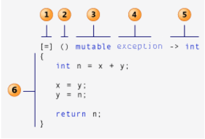

重新温习一下Qt的教程，回顾下相关知识

## Qt开发环境的搭建和helloworld

1. release版本
2. 配置icon

## Qt多窗口程序

1. 在界面上显示的中文仍然使用tr("中文")，便于使用Qt预言家来翻译整个软件要显示的字符创。
2. 通过UI来设置信号和槽
3. 在QtDesigner界面可以设置信号和槽
4. QMessageBox
5. lineEdit设置占位符
6. lineEdit的trim和clear
7. 类的前置声明

设置信号和槽的方式：

1. F4拖动
2. 右键转到槽，会要求选择信号
3. QtDesigner中选择加号
4. 纯代码设置

## 添加菜单图标

1. 菜单如果方无法输入中文，可以复制和粘贴
2. 添加资源文件
   1. 避免外部文件的问题
   2. 压缩
3. 菜单栏、菜单项

## 布局管理器

1. QSplitter
2. Vertical Layout

## 实现Qt文本编辑功能

实现新建、保存和另存为三个功能

## 实现Qt文本查找功能

1. dialog添加layout布局
2. refactor功能，在.h中添加声明，然后直接在.cpp中实现定义
3. %1作为占位符，在显示时会被arg()中的参数替换掉

   ```C++
    QMessageBox::warning(this, tr("查找"),
            tr("找不到%1").arg(str));
   ```

4. 文件定位方法，使用定位器。

## 设置主窗口状态栏

1. 添加动作状态提示statusTip
2. 显示其他临时信息

## Qt键盘、鼠标事件的处理

## Qt定时器和随机数

定时器，一种是定时器事件，另一种是使用信号和槽。一般使用了多个定时器时最好使用定时器事件来处理。

## 2D绘图

### 渐变填充

### 绘制文字

### 绘制路径

### 绘制图片

QImage、QPixmap、QBitmap和QPicture，它们都是常用的绘图设备。其中QImage主要用来进行I/O处理，它对I/O处理操作进行了优化，而且可以用来直接访问和操作像素；QPixmap主要用来在屏幕上显示图像，它对在屏幕上显示图像进行了优化；QBitmap是QPixmap的子类，用来处理颜色深度为1的图像，即只能显示黑白两种颜色；QPicture用来记录并重演QPainter命令。

QPixmap 缩放、旋转、扭曲等

### Qt坐标系统

### 双缓冲绘图

这一部分并没有完成，源代码也没有正确运行，如果默认都有双缓冲的话，那一开始的代码是怎么回事。

### 2D绘图部分窗口、视口的研究

图形视图提供大量定制的2D图形项进行管理和相互作用，便于控制多个图形以及之间的相互作用。主要包括Scene、View和Item。

QDrag
QMineData
QCursor

## 数据库 SQL模块

这一部分目前涉及比较少，暂时不深入研究

该模块可以分为

- 用户接口层：用户接口层的几个类实现了将数据库中的数据链接到窗口部件上，它们是更高层次的抽象，即便不熟悉SQL也可以操作数据库
  QSqlQueryModel、QSqlTableModel和QSqlRelationalTableModel
- SQL接口层：SQL接口层提供了对数据库的访问
  QSqlDatabase、QSqlQuery、A=QSqlError、QSqlField、QSqlIndex和QSqlRecord
- 驱动层：驱动层为具体的数据库和SQL接口层之间提供了底层的桥梁
  QSqlDriver、QSqlDriverCreator、SQqlDriverCraetorBase、QSqlDriverPlugin和QSqlResult

### 简介

### 安装MySQL数据库

### 利用QSqlQuery类执行SQL语句

有界面和按钮之间的信号和槽控制

1. 创建
2. 操作结果
3. 使用变量
4. 批处理
5. 事务操作：保证一个复杂的操作的原子性就是对于一个数据库操作序列，这些操作要么全部做完，要么一条也不做，它是一个不可分割的工作单位。

### SQL查询模型QSqlQueryModel

简单操作和自定义（读写）

## XML

1. 使用DOM读取XML文档
2. 使用DOM创建和操作XML文档，包含UI操控
3. Qt中的SAX，另一种读取XML文档的方法，速度更快
4. 使用流读写XML：QXmlStreamReader和QXmlStreamWriter，是SAX地替代品

总的来说，QT提供了3种读取XML文档的方法：

1. QXmlStreamReader：一种快速的基于流的方式访问XML文档，特别使用于一次解析
2. DOM（Document Object Model）：将整个XML文档读入内存，构建一个树结构，允许程序在树上向前向后移动导航，可以允许多次解析。
3. SAX（Simple API for XML）：提供大量虚函数，以事件的形式处理XML，是为了解决DOM得到内存占用问题提出的。

生成XML文档方法：

1. QXmlStreamWriter：最快最方便的XML方法
2. DOM，首先在内存中生成DOM树，然后将DOM树写入文件，临时生成树再写入比较麻烦。
3. 手动生成XML

## Qt元对象和属性系统

Qt 的元对象系统（Meta-Object System）提供了对象之间通信的信号与槽机制、运行时类型信息和动态属性系统。

元对象系统由以下三个基础组成：

1. QObject 类是所有使用元对象系统的类的基类。
2. 在一个类的 private 部分声明 Q_OBJECT宏，使得类可以使用元对象的特性，如动态属性、信号与槽。
3. MOC（元对象编译器）为每个 QObject 的子类提供必要的代码来实现元对象系统的特性。

## Qt中的基本数据类型

- [QT基本数据类型](https://blog.csdn.net/qq_15647227/article/details/83956078)

## 编译时遇到的一些错误

- [error LNK2001: 无法解析的外部符号 "public: virtual struct QMetaObject const * __thiscall Widget::metaObject](https://blog.csdn.net/qq_35488967/article/details/72847088)
  
## 信号和槽

- [qt5中信号和槽的新语法 cnblogs](https://www.cnblogs.com/mushroom/p/5701330.html)
- [New Signal Slot Syntax](https://wiki.qt.io/New_Signal_Slot_Syntax)
- [C++_之Qt的信号和槽的详解 cnblogs](https://www.cnblogs.com/wanghui1234/p/8964968.html)
- [QT实现信号与槽之间传递QVector类型的数据 CSDN](https://blog.csdn.net/u012372584/article/details/88252002) 可以不用这么麻烦
- [QT子线程与主线程的信号槽通信](https://blog.csdn.net/zhenguo26/article/details/82588415) 传结构体
- [Passing QVector<float> from worker thread to main thread via signal/slot](https://stackoverflow.com/questions/10719553/passing-qvectorfloat-from-worker-thread-to-main-thread-via-signal-slot) 传QVector
- [信号与槽的新语法(Qt5) CSDN](https://blog.csdn.net/dbzhang800/article/details/6547196)
- 
### 概述

所谓信号槽，实际就是观察者模式。**当某个事件发生之后**，比如，按钮检测到自己被点击了一下，**它就会发出一个信号（signal）**。这种发出是没有目的的，类似广播。**如果有对象对这个信号感兴趣，它就会使用连接（connect）函数**，意思是，**将想要处理的信号和自己的一个函数（称为槽（slot））绑定来处理这个信号**。也就是说，**当信号发出时，被连接的槽函数会自动被回调**。这就类似观察者模式：当发生了感兴趣的事件，某一个操作就会被自动触发。
**信号和槽是Qt特有的信息传输机制，是Qt设计程序的重要基础，它可以让互不干扰的对象建立一种联系。**
槽的本质是类的成员函数，其参数可以是任意类型的。和普通C++成员函数几乎没有区别，它可以是虚函数；也可以被重载；可以是公有的、保护的、私有的、也可以被其他C++成员函数调用。唯一区别的是：**槽可以与信号连接在一起，每当和槽连接的信号被发射的时候，就会调用这个槽。**Qt5中的新语法可以将信号connect到QObject的任何成员方法，不仅仅是定义的槽。

### 使用

Qt5中的使用方式：

```C++
#include <QApplication>
#include <QPushButton>

int main(int argc, char *argv[])
{
    QApplication app(argc, argv);

    QPushButton button("Quit");
    QObject::connect(&button, &QPushButton::clicked,
                    &app, &QApplication::quit);
    button.show();
    return app.exec();
}

```

connect()函数最常用的一般形式：

```C++
connect(sender, signal, receiver, slot);
```

参数：

- sender：发出信号的对象
- signal：发送对象发出的信号
- receiver：接收信号的对象
- slot：接收对象在接收到信号之后所需要调用的函数

**信号槽要求信号和槽的参数一致，所谓一致，是参数类型一致**。如果不一致，**允许的情况是，槽函数的参数可以比信号的少，即便如此，槽函数存在的那些参数的顺序也必须和信号的前面几个一致起来。**这是因为，你可以在槽函数中选择忽略信号传来的数据（也就是槽函数的参数比信号的少），但是不能说信号根本没有这个数据，你就要在槽函数中使用（就是槽函数的参数比信号的多，这是不允许的）。

Qt4的使用方式：

```C++
int main(int argc, char *argv[]) 
{ 
        QApplication a(argc, argv);
        QPushButton *button = new QPushButton("Quit");
        connect(button, SIGNAL(clicked()), &a, SLOT(quit()));
        button->show();
        return a.exec();
}
```

这里使用了**SIGNAL**和**SLOT**这两个宏，**将两个函数名转换成了字符串**。注意到connect()函数的signal和slot都是接受字符串，**一旦出现连接不成功的情况，Qt4是没有编译错误的**（因为一切都是字符串，编译期是不检查字符串是否匹配），**而是在运行时给出错误。这无疑会增加程序的不稳定性**。

Qt中使用了新的信号和槽语法，作为旧语法的一种补充。

**旧语法**
qt5将继续支持旧的语法去连接，在QObject对象上定义信号和槽函数，及任何继承QObjec的对象（包含QWidget）

```C++
connect(sender, SIGNAL (valueChanged(QString,QString)),receiver, SLOT (updateValue(QString)) );
```

### 自定义信号和槽

使用 Qt 的信号槽，实现一个报纸和订阅者的例子：
有一个报纸类Newspaper，有一个订阅者类Subscriber。Subscriber可以订阅Newspaper。这样，当Newspaper有了新的内容的时候，Subscriber可以立即得到通知。

**newspaper.h**

```C++
#include <QObject>
class Newspaper : public QObject
{
    Q_OBJECT
public:
    Newspaper(const QString & name) :
        m_name(name)
    {
    }

    void send()
    {
        emit newPaper(m_name);
    }

signals:
    void newPaper(const QString &name);

private:
    QString m_name;
};
```

**reader.h**

```C++
#include <QObject>
#include <QDebug>
 
class Reader : public QObject
{
    Q_OBJECT
public:
    Reader() {}

    void receiveNewspaper(const QString & name)
    {
        qDebug() << "Receives Newspaper: " << name;
    }
};
```

**main.cpp**

```C++
#include <QCoreApplication>
#include "newspaper.h"
#include "reader.h"

int main(int argc, char *argv[])
{
    QCoreApplication app(argc, argv);

    Newspaper newspaper("Newspaper A");
    Reader reader;
    QObject::connect(&newspaper, &Newspaper::newPaper,
                     &reader,    &Reader::receiveNewspaper);
    newspaper.send();
    return app.exec();
}
```

Newspaper类继承了QObject类。**只有继承了QObject类的类，才具有信号槽的能力**。所以，为了使用信号槽，必须继承QObject。凡是QObject类（不管是直接子类还是间接子类），都应该在第一行代码写上Q_OBJECT。不管是不是使用信号槽，都应该添加这个宏。**这个宏的展开将为我们的类提供信号槽机制、国际化机制以及 Qt 提供的不基于 C++ RTTI 的反射能力**。

Newspaper类的 public 和 private 代码块都比较简单，只不过它新加了一个 signals。signals块所列出的，就是该类的信号。**信号就是一个个的函数名，返回值是void**（因为无法获得信号的返回值，所以也就无需返回任何值），参数是该类需要让外界知道的数据。**信号作为函数名，不需要在cpp函数中添加任何实现**。

Newspaper类的send()函数比较简单，只有一个语句emit newPaper(m_name);。**emit是Qt对C++的扩展，是一个关键字（其实也是一个宏）**。emit的含义是发出，也就是发出newPaper()信号。感兴趣的接收者会关注这个信号，可能还需要知道是哪份报纸发出的信号？所以，**我们将实际的报纸名字m_name当做参数传给这个信号。当接收者连接这个信号时，就可以通过槽函数获得实际值**。这样就完成了数据从发出者到接收者的一个转移。

Reader类更简单。因为这个类需要接受信号，所以我们将其继承了QObject，并且添加了Q_OBJECT宏。后面则是默认构造函数和一个普通的成员函数。**Qt5中，任何成员函数、static 函数、全局函数和 Lambda 表达式都可以作为槽函数**。与信号函数不同，槽函数必须自己完成实现代码。**槽函数就是普通的成员函数，因此作为成员函数，也会受到public、private 等访问控制符的影响**。（**如果信号是private的，这个信号就不能在类的外面连接，也就没有任何意义**。）

小结：

- 发送者和接收者都需要是QObject的子类（当然，槽函数是全局函数、Lambda 表达式等无需接收者的时候除外）；
- 使用 signals 标记信号函数，信号是一个函数声明，返回 void，不需要实现函数代码；
- 槽函数是普通的成员函数，作为成员函数，会受到 public、private、protected 的影响；
- 使用 emit 在恰当的位置发送信号；
- 使用QObject::connect()函数连接信号和槽。
- 任何成员函数、static 函数、全局函数和 Lambda 表达式都可以作为槽函数
- 槽函数需要和信号一致（参数，返回值），由于信号都是没有返回值，所以槽函数一定没有返回值

### 信号槽的更多用法

- 一个信号可以和多个槽相连
　　如果是这种情况，这些槽会一个接一个的被调用，但是它们的调用顺序是不确定的。
- 多个信号可以连接到一个槽
　　只要任意一个信号发出，这个槽就会被调用。

- 一个信号可以连接到另外的一个信号
　　当第一个信号发出时，第二个信号被发出。除此之外，这种信号-信号的形式和信号-槽的形式没有什么区别。
- 槽可以被取消链接
　　这种情况并不经常出现，因为当一个对象delete之后，Qt自动取消所有连接到这个对象上面的槽。
- 使用Lambda 表达式
　　在使用 Qt 5 的时候，能够支持 Qt 5 的编译器都是支持 Lambda 表达式的。
　　我们的代码可以写成下面这样：

    ```C++
    QObject::connect(&newspaper, static_cast<void (Newspaper:: *)
    (const QString &)>(&Newspaper::newPaper),
    [=](const QString &name)
    { /* Your code here. */ }
    );
    ```

    在连接信号和槽的时候，槽函数可以使用Lambda表达式的方式进行处理。

### 新旧语法对比

**新语法：连接到QObject成员**
下面是一种新的方式来连接两个QObjects：

```C++
connect(sender, &Sender::valueChanged,receiver, &Receiver::updateValue );
```

它支持：

- 编译期间检查信号和槽是否存在，它们的类型，及Q_OBJECT是否丢失
- 参数能被typedef或不同命名空间指定。
- 如果有隐式转换的参数，会自动转换类型。比如QString到QVariant
- 它可以连接QObject的任何成员方法，不仅仅是定义的槽。

旧版本的不足原因是旧语法connect接收的是两个字符串：

```C++
bool QObject::connect ( const QObject * sender, const char * signal, const QObject * receiver, const char * method, Qt::ConnectionType type = Qt::AutoConnection ) [static]
```

例如：

```C++
connect(slider, SIGNAL(valueChanged(int)), spinbox, SLOT(setValue(int)));
```

编译预处理后就是：

```C++
connect(slider, "2valueChanged(int)", spinbox, "1setValue(int)");
```

这将导致：

- 即使信号和槽不存在，编译不会出问题。只有运行时会给出警告并返回false，可是大部分用户并不检查返回值。
- 参数必须匹配，比如信号参数是 int，槽参数是 double，语法将会 connect 失败
- 参数类型必须字面上一样，比如说都是int，但是其中一个typedef了一下，或者namespace修饰不同，都会导致连接失败。

而在新语法中避免掉了这些问题。但它不支持：

- 更复杂的语法？你需要指定你的对象类型、
- 非常复杂的语法，比如重载，参见后面。
- **在槽的中默认参数不再被支持**。

很典型的例如`QSpinBox`重载了信号`valueChanged()`，因此不能将

```C++
connect(mySpinBox, SIGNAL(valueChanged(int)), mySlider, SLOT(setValue(int));
```

简单转换为

```C++
connect(
    mySpinBox, &QSpinBox::valueChanged,
    mySlider, &QSlider::setValue
);
```

需要使用强制类型转换

```C++
connect(
    mySpinBox, static_cast<void (QSpinBox::*)(int)>(&QSpinBox::valueChanged),
    mySlider, &QSlider::setValue
);
```

不过这种显示转换可能还是会让某些错误跳过编译器，可以容如下赋值临时变量的方法来保持编译期的检查：

```C++
void (QSpinBox::* mySignal)(int) = &QSpinBox::valueChanged;
connect(
    mySpinBox, mySignal,
    mySlider, &QSlider::setValue
);
```

当然还有一些其他方法，但**最好就是不要重载信号和槽**。

### 传递非基本数据类型

正常情况下信号和槽只能传递通用数据类型，例如`QVector`、`QString`和结构体等不能传递，编译可能不会出错，但槽函数不会被调用，需要对复杂数据做一些包装处理才行。可以使用

```C++
qRegisterMetaType<QVector<float> >("QVector<float>");

class Msg
{
    int int_info_;
    std::string str_info;   // 不知道是否还要对string再注册下
}

qRegisterMetaType<Msg>("Msg");
```

### lambda表达式

C++11中的Lambda表达式用于定义并创建匿名的函数对象，以简化编程工作。首先看一下Lambda表达式的基本构成：


```C++
[函数对象参数](操作符重载函数参数)mutable或exception ->返回值{函数体}
```

1. 函数对象参数；
　　[]，标识一个Lambda的开始，这部分必须存在，不能省略。函数对象参数是传递给编译器自动生成的函数对象类的构造函数的。函数对象参数只能使用那些到定义Lambda为止时Lambda所在作用范围内可见的局部变量（包括Lambda所在类的this）。函数对象参数有以下形式：

     - 空。没有使用任何函数对象参数。
     - =。函数体内可以使用Lambda所在作用范围内所有可见的局部变量（包括Lambda所在类的this），并且是值传递方式（相当于编译器自动为我们按值传递了所有局部变量）。
     - &。函数体内可以使用Lambda所在作用范围内所有可见的局部变量（包括Lambda所在类的this），并且是引用传递方式（相当于编译器自动为我们按引用传递了所有局部变量）。
     - this。函数体内可以使用Lambda所在类中的成员变量。
     - a。将a按值进行传递。按值进行传递时，函数体内不能修改传递进来的a的拷贝，因为默认情况下函数是const的。要修改传递进来的a的拷贝，可以添加mutable修饰符。
     - &a。将a按引用进行传递。
     - a, &b。将a按值进行传递，b按引用进行传递。
     - =，&a, &b。除a和b按引用进行传递外，其他参数都按值进行传递。
     - &, a, b。除a和b按值进行传递外，其他参数都按引用进行传递。

    ```C++
        int m = 0, n = 0;
        [=] (int a) mutable { m = ++n + a; }(4);
        [&] (int a) { m = ++n + a; }(4);

        [=,&m] (int a) mutable { m = ++n + a; }(4);
        [&,m] (int a) mutable { m = ++n + a; }(4);

        [m,n] (int a) mutable { m = ++n + a; }(4);
        [&m,&n] (int a) { m = ++n + a; }(4);
      ```

2. 操作符重载函数参数；
    标识重载的()操作符的参数，没有参数时，这部分可以省略。参数可以通过按值（如：(a,b)）和按引用（如：(&a,&b)）两种方式进行传递。
3. 可修改标示符；
    mutable声明，这部分可以省略。按值传递函数对象参数时，加上mutable修饰符后，可以修改按值传递进来的拷贝（注意是能修改拷贝，而不是值本身）。
4. 错误抛出标示符；
    exception声明，这部分也可以省略。exception声明用于指定函数抛出的异常，如抛出整数类型的异常，可以使用throw(int)
5. 函数返回值；
    ->返回值类型，标识函数返回值的类型，当返回值为void，或者函数体中只有一处return的地方（此时编译器可以自动推断出返回值类型）时，这部分可以省略。
6. 是函数体；
    {}，标识函数的实现，这部分不能省略，但函数体可以为空。