近期需要做一个调试小工具，用于可视化调试LUT，可以使用Qt的Qwt库，全称是Qt Widgets for Technical Applications，用于生成各种统计图。

## 安装

官网介绍[Qwt User's Guide](https://qwt.sourceforge.io/index.html)

MSVC-2015 64bit的完整安装教程，[Installing Qwt with MSVC-2015 64bit compiler on Windows (complete instructions)](https://www.qtcentre.org/threads/66576-Installing-Qwt-with-MSVC-2015-64bit-compiler-on-Windows-(complete-instructions))。我使用的是Qt 5.12.0。源码路径和安装路径最好分离开，便于重新再来。
完整以上安装后，为了方便VS使用还需要做一些简单lib、bin和include的配置。参考[QWT6.1.3编译、配置和使用（Vs2010+Qwt6.1.3+Qt5.5.1编译）](https://blog.csdn.net/toby54king/article/details/78852396)。

安装后的文件
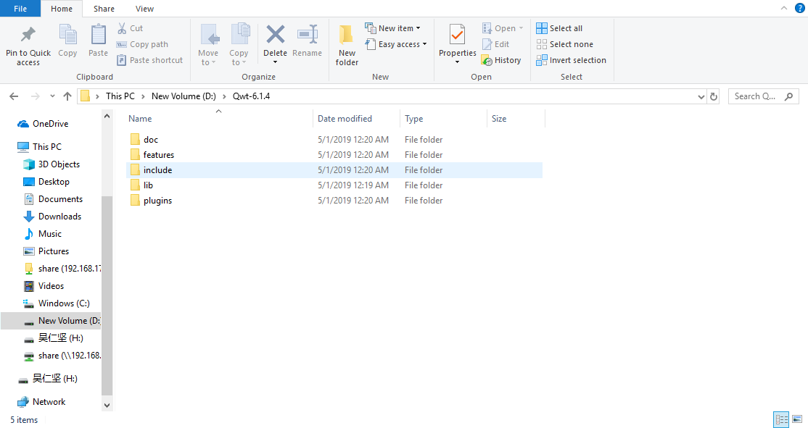

1. 对Qt的安装路径配置环境变量
   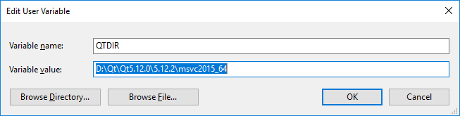
2. 拷贝include目录到Qt的include目录，最好新建个Qwt的子目录
3. 拷贝**lib\qwt.lib**和**qwtd.lib**到Qt的lib目录下
4. 拷贝**lib\qwt.dll**和**qwtd.dll**到Qt的bin目录下
5. 拷贝**plugins\designer\qwt_designer_plugin.dll**到**plugins\designer**目录下，用于qt designer。
6. 配置VS（有些不是必须的，但最好配置上）
   1. 配置头文件：`$(QTDIR)\include\Qwt`
   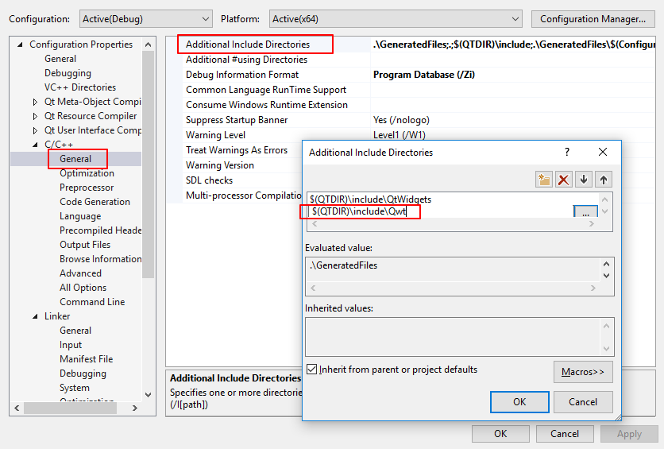
   1. 配置可执行文件：`qwtd.lib`（如果是Release版本用`qwt.lib`）
   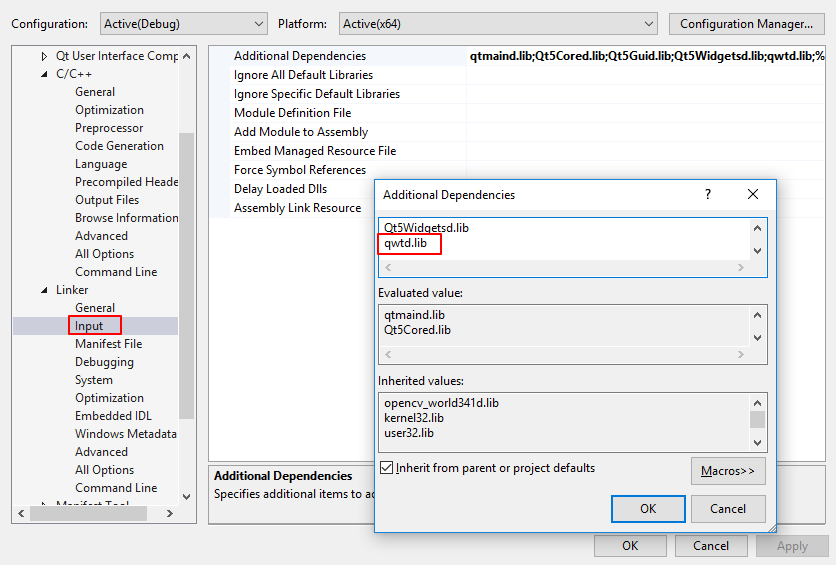
   1. 配置预处理器：QWT_DLL
   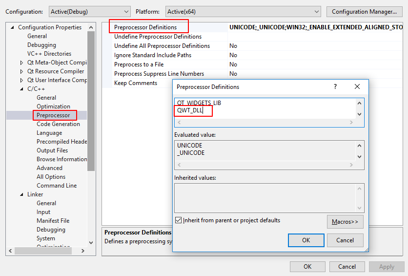
7. 跑提供的测试代码[Installing Qwt with MSVC-2015 64bit compiler on Windows (complete instructions)](https://www.qtcentre.org/threads/66576-Installing-Qwt-with-MSVC-2015-64bit-compiler-on-Windows-(complete-instructions))
   基本效果如下
   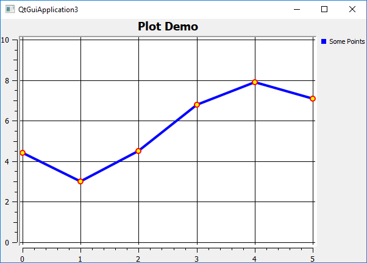

MSVC-2017应该也有类似的教程。

## qwt demo

网络上的资源参差不齐，最好还是从官方提供的example入手，之前就是因为没有完整编译好工程导致有些demo没看到，苦苦看源码搜资料查了好久。

1. animation
2. barchart：柱状图、导出按钮combox
3. bode：picker数据拾取器
4. controls：多个tab
5. cpuplot：legend选择可隐藏
6. curvdemo1
7. dials：多个tab
8. distrowatch
9. event_filter：曲线上鼠标拖动点
10. friedberg
11. itemeditor：editor
12. legends：layout设计、多个按钮控制显示
13. oscilloscope
14. radio
15. rasterview：放大缩小
16. realtime：组合控制
17. refreshtest
18. scatterplot：平移放大缩小
19. simpleplot：简单曲线显示
20. sinusplot：always picker
21. spectrogram
22. stockchart：checkbox
23. sysinfo
24. tvplot

这里列几个典型的

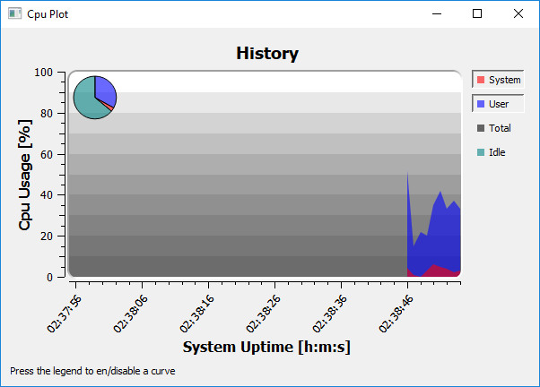
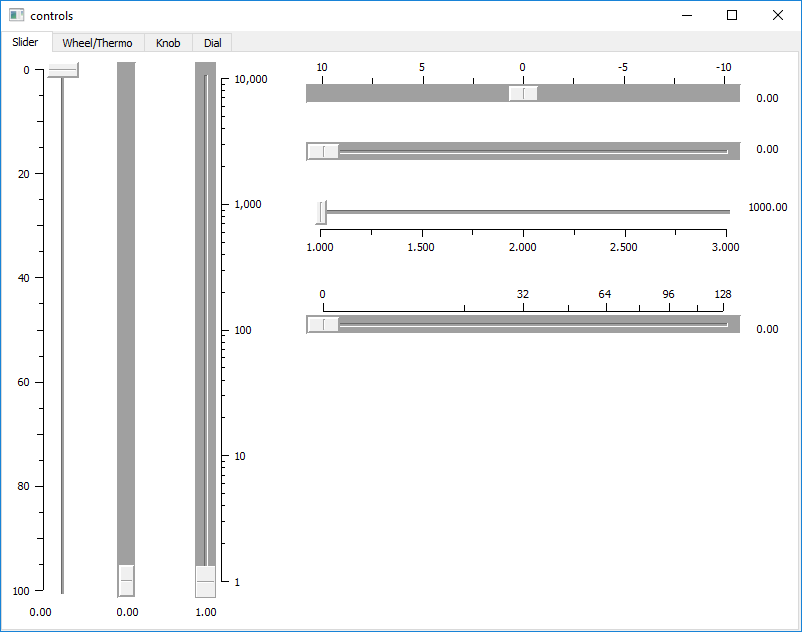
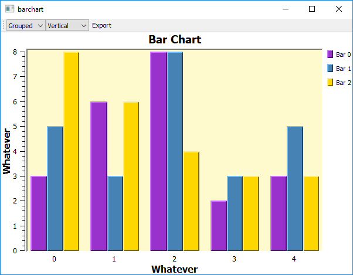
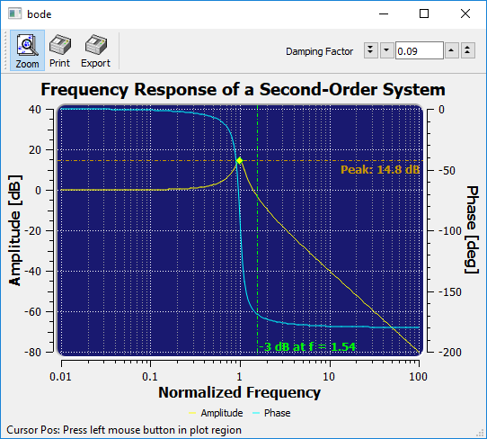

## 使用过程中一些小细节

1. 按钮出现中文乱码

```C++
// 源码文件的字符集不是UTF8 ？
// 如果是Qt5.x，则：
fileBtn->setText(tr("文件标准对话框"));
// 修改为
fileBtn->setText(QStringLiteral("文件标准对话框"));
```

2. pushbutton的简单使用
3. [Qt QPushButton](https://blog.csdn.net/qq_25800311/article/details/80913477)

## Qt的MVC设计模式

网络上关于Qt的介绍还是相对不多的，这里记录下Qt相关的东西，便于回溯。

### 架构、框架和设计模式

ref:
[架构、框架和设计模式](https://www.cnblogs.com/the-wang/p/7258303.html)

#### 软件架构

软件架构是系统的一个草图，阐述了各个组件之间的通信，层次划分，一旦系统开始详细设计，架构蓝图就很难甚至无法改变。

例如：三层架构：一种设计软件架构的思想。

通常意义上的三层架构就是将整个业务应用划分为表示层（User Interface  Layer）、业务逻辑层（Buesiness Logic Layer）、数据访问层（Data Access Layer）。区分层次的目的是为了体现“高内聚，低耦合”的思想。

1. 表示层
    表示层位于最外层（最上层），最接近于用户。用于显示数据和接收用户输入的数据为用户提供一种交互式的操作界面。
2. 业务逻辑层
    业务逻辑层无疑是系统架构中体现核心价值的部分。他的关注点主要集中在业务规则的制定、业务流程的实现等与业务需求相关的系统设计上，也就是说，他与系统所对应的领域（Domain）逻辑有关，很多时候，也将业务逻辑层称为领域层。
    业务逻辑层在体系架构中的位置很关键，他处于数据访问层与表示层中间起到了数据交换中承上启下的作用。对于数据访问层而言，他是调用者；对于表示层而言，他却是被调用者。
3. 数据访问层
    数据访问层有时候也称为持久层，其功能主要是负责数据库的访问，可以访问数据库系统、二进制文件、文本文档、或是XML文档。简单的说法就是实现对数据表的Select、Insert、Update和Delete操作。

#### 框架

软件框架是（Framework）是项目软件开发过程中提取特定领域软件的共性部分形成的体系结构，不同领域的软件项目有着不同的框架类型。**框架的作用在于：由于提取了特定领域软件的共性部分，因此在此领域内新项目开发过程中代码不需要从头编写，只需要编写在框架的基础上进行一些开发和调整便可满足要求：对于开发过程而言，这样做会提高软件的质量减低成本，缩短开发时间，是的开发越做越轻松，效益越做越好，形成一种良性循环。**

框架不是现成可用的应用系统，**他是一个半成品**，需要后来的开发人员进行二次开发，实现具体功能的应用系统。框架也不是平台，平台的概念比较模糊，他可以是一种操作系统、一种应用服务器、一种数据库软件或一种通信软件等，因此平台在应用方面主要指提供特定服务的系统软件；而框架更侧重于设计和开发过程，或者可以说，框架通过调用平台提供的服务而起作用。

框架也不是工具包或者类库。望文生义，类库就是一些类的集合，只要我们将一些可以复用的类集中放到一个Library中，就可以称其为一个类库。类库中的许多元素（如：类、结构、接口、枚举等）之间可能有一些关联，但这些关联通常用于支持一个类概念或接口概念的完整表达。如果从一个更高的视角来审视类库，可以发现类库中的一个个“完整的概念”之间是无关的或是关系松散的，框架和类库有着相似的形式，即框架往往也是类的集合；但不同之处在于，**框架中的各个类并不是孤立的，框架中的业务逻辑代码是将不同的类连在一起在他们之间建立协作关系**，例如：Spring-一个开源的Web设计规范。

#### 设计模式

设计模式（Design pattern）代表了最佳的实践，通常被有经验的面向对象的软件开发人员所采用。设计模式是软件开发人员在软件开发过程中面临的一般问题的解决方案。这些解决方案是众多软件开发人员经过相当长的一段时间的试验和错误总结出来的。

设计模式是对某种环境下反复出现的问题以及解决该问题的方案描述，比框架更加抽象；框架可以用代码表示，也能直接执行或复用，而对模式而言只有实例才能用代码表示;设计模式是比框架更小的元素，一个框架中往往含有一个或多个设计模式，框架总是针对某一特定应用领域，但同一模式却可适用于各种应用。

#### 比较

1. 框架与设计模式
    框架通常是代码重用，而设计模式是设计重用，架构介于两者之间，部分代码重用部分设计重用。
    设计模式研究的是针对单一问题的设计思路和解决方法，一个模式可以应用于不同的框架和被不同的语言所实现；而框架则是一个应用的体系结构，是一种或多种设计模式和代码的混合体，虽然他们有所不同，但却共同致力于使人们的设计可以被重用，在思想上存在着统一性的特点，因而设计模式的思想可以在框架设计中进行应用。
2. 框架与架构
    框架不是架构，框架比架构更具体，更偏重于技术，而架构偏重于设计。一个架构可以通过多种框架来实现.
3. 架构与设计模式
    设计模式主要是针对单一问题的解决方法，范畴比较小，而架构是高层次的针对体系结构的一种设计思路，范畴比较大。可以说一个架构中可能会出现多个设计模式类解决架构中的多种问题。

通过上面的分析，可以看出这三者之间得区别还有很多，首先架构是一个范畴最大的概念，是最高层次的设计，一个架构设计中可能会用到多个框架和多个设计模式；而框架是针对共性抽象出来的半成品，这里面可能包含着多个设计模式；而设计模式就是解决单一问题的设计思路和解决方法。

要做好一个项目，架构设计、框架设计和使用、设计模式都是非常重要的。**我们在做一个项目的时候首先设计出来的应该是架构，是对整个问题的一个总体上的设计，之后再会考虑运用什么样的框架和设计模式来实现我们的框架；当然，只使用框架和设计模式中的一种也是经常遇到的。**

这三者的共同点都是为解决现实生活中的问题而出现的，都为了使我们的设计更面向对象化。

### MVC

MVC设计模式起源于SmallTalk的一种与用户界面相关的设计模式，可以有效分离数据和用户界面。

MVC设计模式包含三个元素：
表示数据的模型（Model），表示用户界面的识图（View），定义了用户在界面上的操作控制（Control）。这和典型的三层架构不同。MVC是设计模式，属于微观的解决方案；三层架构是系统架构，属于宏观的解决方案。

### Qt的MVC——InterView框架（MVD）

- [Qt的MVC设计模式——InterView框架（MVD）](https://blog.csdn.net/weixin_39743893/article/details/80625759)
- [Qt5MVC模式(一)](https://blog.csdn.net/u012521552/article/details/51771318)
- [Qt中的MVC （模型/视图结构）](https://blog.csdn.net/rl529014/article/details/52072380)

与MVC设计模式类似，Qt引入了模型/视图结构用于完成数据与界面的分离，即InterView框架。但不同的是，Qt的InterView框架中把视图和控制部件结合在一起，使得框架更为简洁。
为了灵活地处理用户输入，InterView框架引入了代理（Delegate）。通过使用代理，能够自定义数据条目（item）的显示和编辑方式。

Qt的模型/视图结构分为了三种部分：

- 模型（Model）
- 视图（View）
- 代理（Delegate）

如下图，模型与数据通信，并为了其它部件提供接口；
而视图从模型中获得用来引用数据条目的模型索引（Model Index）；
在视图中，代理负责绘制数据条目，当编辑条目时，代理和模型直接进行通信。
模型/视图/代理之间通过信号和槽进行通信。

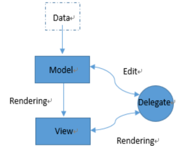

它们之间的关系如下：
数据发生改变时，模型发出信号通知视图；
用户对界面进行操作，视图发生信号；
代理发出信号告知模型和视图编辑器目前的状态。

### 基本概念

1. 模型（Model）
    抽象基类QAbstractItemModel
    列表的抽象基类QAbstractListModel、表格的抽象基类QAbstractTableModel、QAbstractProxyModel
    QProxyModel
    QDirModel
    QFileSystemModel
    QHelpContentModel
    QStandardItemModel类继承
2. 视图（View）
    抽象基类QAbstractItemView
    QListView—QListWidget\QUndoView
    QTableView—QTableWidget
    QTreeView—QTreeWidget
    QColumnView
    QHeaderView
    实际上：QListWidget、QTableWidget、QTreeWidget已经包含数据，是模型与视图集成的。
3. 代理（Delegate）
    抽象基类QAbstractItemDelegate
    QItemDelegate
    QStyleItemDelegate
    类QItemDelegate由类QSqlRelationDelegate继承
