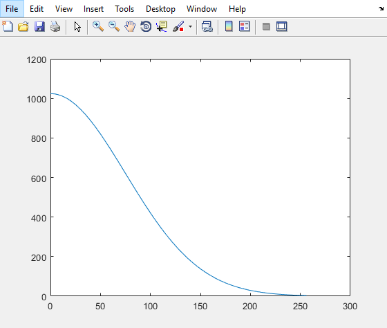

有一段代码是利用高斯函数来做曲线拟合的，比较简单和方便，调试起来可能也会简单些。首先利用高斯函数生成0~256之间的sigma为75的曲线，第一个点按照1024归一化。大致如下


然后利用标准正太分布公式来计算给定sigma和mean的高斯曲线。

```C++
#define _CRT_SECURE_NO_WARNINGS
#include <iostream>
#include <cstdio>
#include <cmath>

const int STD_GS_LUT_Bit = 8;
const int STD_GS_Sigma = 75;
const int STD_GS_Mean = 0;
const int STD_GS_PRCS = 10; // prcs of output
const int STD_GS_LUT_Sz = (1 << STD_GS_LUT_Bit) + 1;
static int STD_GS_LUT[STD_GS_LUT_Sz];

int LUTInter(int val, int valBit, int *LUT, int LUTBit) {
    const int LUTSz = (1 << LUTBit) + 1;
    const int shift = valBit - LUTBit;
    const int index = val >> shift;
    if (index >= LUTSz - 1) { // index + 1>= LUTSz -> index + 1 <= LUTSz - 1 -> index + 1 < LUTSz
        return LUT[LUTSz - 1];
    } else {
        int ret = LUT[index] + ((LUT[index + 1] - LUT[index]) * (val - (index << shift)) >> shift);
        return ret;
    }
}

void LUTInterFromSTD_GS(int *LUT, int LUTSz = 33, int mean = 0, int sigma = 80, int weight = 50) {
    const int STD_LUT_Bit = 8;
    const int PRCS = 10;
    int shift = PRCS;
    const int scl = (STD_GS_Sigma << shift) / sigma;
    for (int i = 0; i < LUTSz; ++i) {
        int val = abs((i << 8) / LUTSz - mean) * scl >> 8;
        LUT[i] = (weight * LUTInter(val, shift, STD_GS_LUT, STD_GS_LUT_Bit) + (1 << (shift - 1))) >> shift;
    }
}

void CalcSTD_GS(int *LUT, int sz, int prcs, int sigma, int mean) {
    // prcs 10
    // sigma U6.8
    // mean U6.8

    double var = sigma / 255.0 * sigma / 255.0;
    double u = mean / 255;
    for (int i = 0; i < sz; ++i) {
        double val = i * 1.0 / sz;
        LUT[i] = round((1 << prcs) * exp(-(val - u) * (val - u) / (2 * var)));
    }
}

void printmat(const int *p, int len, const char *filename = "otuput.txt") {
    freopen(filename, "w", stderr);
    for (int i = 0; i < len; ++i)
        fprintf(stderr, "%4d ", p[i]);
    fprintf(stderr, "\n");
}

void ut() {
    CalcSTD_GS(STD_GS_LUT, STD_GS_LUT_Sz, STD_GS_PRCS, STD_GS_Sigma, STD_GS_Mean);
    printmat(STD_GS_LUT, STD_GS_LUT_Sz, "LUT_STD_GS.txt");
    int lut[33];
    LUTInterFromSTD_GS(lut, 33, 0, 80, 128);
    printmat(lut, 33, "lut.txt");
}

int main() {
    ut();

    return 0;
}
```

```matlab
clr;

x = 0:256;
y = normpdf(x, 0, 75);
y = (y / y(1) * 1024);

LUT = [1024 1024 1024 1023 1023 1022 1021 1020 1018 1017 1015 1013 1011 1009 1007 1004 1001  998  995  992  989  985  982  978  974  969  965  961  956  951  946  941  936  931  925  920  914  908  902  896  890  884  878  871  864  858  851  844  837  830  823  816  808  801  793  786  778  771  763  755  747  739  731  724  716  708  699  691  683  675  667  659  651  642  634  626  618  609  601  593  585  577  569  560  552  544  536  528  520  512  504  496  488  480  473  465  457  449  442  434  427  419  412  405  397  390  383  376  369  362  355  348  342  335  328  322  315  309  303  297  290  284  278  272  267  261  255  250  244  239  233  228  223  218  213  208  203  198  193  189  184  180  175  171  167  163  159  155  151  147  143  139  136  132  129  125  122  118  115  112  109  106  103  100   97   95   92   89   87   84   82   79   77   75   72   70   68   66   64   62   60   58   56   55   53   51   50   48   46   45   43   42   41   39   38   37   36   34   33   32   31   30   29   28   27   26   25   24   23   22   22   21   20   19   19   18   17   17   16   15   15   14   14   13   13   12   12   11   11   10   10   10    9    9    8    8    8    8    7    7    7    6    6    6    6    5    5    5    5    5    4    4    4    4    4    3    3 ];

figure(1);
plot(x, y);
title('gauss curve, \sigma = 75, first point norm to 1024');
% plot(x, y, x, LUT);
d = y - LUT;
max(abs(d))


x = 0:8:256;
y = normpdf(x, 0, 80);
y = (y / y(1) * 128);

LUT = [  128  128  126  123  119  115  109  102   95   89   81   74   66   59   52   45   39   34   29   24   20   17   14   11    9    7    6    5    3    3    2    2    1  ];
figure(2);
plot(x, y, 'b', x, LUT, 'r');
d = y - LUT;
max(abs(d))
```