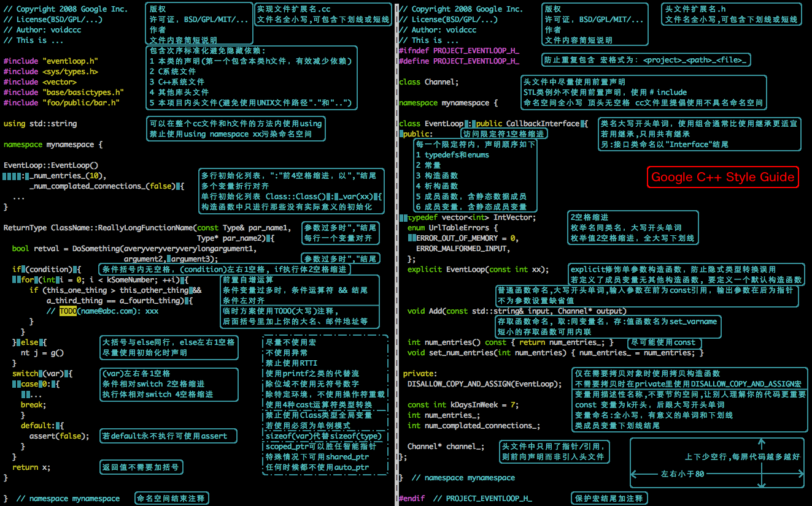

- [Google 开源项目风格指南 (中文版)](https://zh-google-styleguide.readthedocs.io/en/latest/) 包含5个中文版的风格指南
- [Google C++ Style Guide](https://google.github.io/styleguide/cppguide.html)
- [C++ 风格指南 - 内容目录](https://zh-google-styleguide.readthedocs.io/en/latest/google-cpp-styleguide/contents/)
- [一张图总结Google C++编程规范(Google C++ Style Guide)](https://blog.csdn.net/voidccc/article/details/37599203)

华为的编程规范参考了很多的Google编程规范。

有一张图很好的总结了Google的编程规范


## Google编程规范笔记

### 头文件

1. 避免使用前置声明，用头文件
   优点：减少include，节省编译时间，减少重新编译头文件的可能
   缺点：隐藏了依赖关系
   前置声明是不完整类型
2. 10行代码下才适合内联，不适用于循环和析构函数
3. include顺序
   对应的头文件；C系统文件；C++系统文件；其他库的头文件；本项目的头文件
   对应头文件放在最前面，可以在build的时候及时发现错误

### 作用域

1. 命名空间内不缩进
2. 鼓励在cc文件中使用匿名命名空间和static声明，但不能在h文件中使用；（匿名空间其实就是文件作用域，类似于C中的static声明的作用域）
3. cc文件中的变量不会被外部文件引用时，使用匿名空间或者static，因为具有内部链接性，不会在其他文件中访问到；（尽可能限制作用域范围，避免污染）
4. 静态成员函数或非成员函数最好放在命名空间中，静态成员应该是和类相关的，如果不相关最好放在命名空间中，尽量单独形成编译单元
5. 禁止定义静态储存周期非POD变量，构造、析构和初始化可能是不确定的

### 类

1. 类定义中单参数的构造函数应该用`explicit`标记
2. 优先组合，而非继承；虽然继承可以复用代码，但耦合性太高，散布在父子类之间的代码理解起来更不易；不能重写非虚函数；基类可能有自己的数据成员，对理解有挑战，实际很难拿捏准；
3. 不要重载，除非确有需要，因为容易混淆，如重载
4. 不在构造函数中做过多逻辑相关的初始化

### 函数

1. 入参在前，出参在后
2. 输入参数是值参或const引用（不要使用非const引用，容易误解），输出参数为指针

### 其他

1. 尽少使用默认参数，改用重载
2. 不使用C++异常，得不偿失，虽然允许高层决定底层中不可能的失败，减少使用错误代码，但实际上常安全很困难，异常可能会扰乱程序的正常流程
3. 禁用RTTI。RTTI虽然允许C++在运行时识别对象的类型，通过`dynamic_cast`和`typeid`
4. 用static_cast替代C风格的值转换
5. 只在记录日志时使用流：否则容易混乱IO类型
6. 内建整型仅用int，否则使用`<stdint.h>`中长度精确的整型
7. 尽可能用`sizeof(varname)`代替`sizeof(type)`，因为变量类型改变时会自动更新
8. C++ 11中用nullptr，03用NULL
9. 注意64位可移植型，例如对齐和指针大小等
10. 预处理宏
    1. 不在.h中使用宏
    2. 在马上使用时才定义

11. 不使用复杂的模板编程
    1. 对不熟练C++的人难理解
    2. 编译出错的信息友好
    3. 重构工具难发挥
    4. 维护成本大于简洁的接口
    5. 对外接口不使用模板，仅在内部实现使用

## 命名约定

1. 文件名通通小写，下划线可用可不用
2. 类型命名（类，结构体，类型定义，模板参数，枚举）使用大小写风格，首字母大写——这样可区分类与对象
3. 变量、函数参数、成员数据均小写，下划线连接，类变量成员下划线结尾，结构体的不用
4. 声明为const或constexpr的变量，k开头，大小写混合，静态变量同
5. 函数也是大小写混合，大写开头，并且缩写字母也是首字母大写

   ```C++
    AddTableEntry()
    DeleteUrl()
    OpenFileOrDie()
   ```

6. 命名空间全小写
7. 枚举类型采用常量风格，旧的不用改

   ```C++
   enum UrlTableErrors {
   kOK = 0,
   kErrorOutOfMemory,
   kErrorMalformedInput,
   };
   enum AlternateUrlTableErrors {
       OK = 0,
       OUT_OF_MEMORY = 1,
       MALFORMED_INPUT = 2,
   };
   ```
   
8. 宏命名：全大写，下划线连接
9. 行尾空格两格注释
10. TODO

    ```C++
    // TODO(kl@gmail.com): Use a "*" here for concatenation operator.
    // TODO(Zeke) change this to use relations.
    // TODO(bug 12345): remove the "Last visitors" feature
    ```

11. 注释是为了看懂，不是炫耀语言水平，中英皆可
12. 未被使用的参数注释掉`void Circle::Rotate(double /*radians*/) {}`
13. if可单行，一行可不用花括号，分支中使用了花括号，其他都得加
14. 空循环体用花括号
15. 预处理不缩进，即使在缩进块内
16. public等缩进1格
17. 命名空间不缩进
18. `:`前后有空格

### 规则特例

1. 现有不合规的代码网开一面

## Qt

- Qt5开发及实例(完整版) P111
  
1. 与Google的编码规范基本一致
   1. 成员函数、成员变量命名风格，不过成员变量按照驼峰命名，小写开头，增加下划线
   2. 存取函数按照`Get_var`等进行
2. 控件统一在后面加后缀
3. V和H不需要细分，控件的细分不需要，只需要表达出是哪个控件就好，剩下的知识控件布局的问题，一般复杂度还可以。

```C++
class InputDlg: public QDialog
{
    Q_OBJECT

public:
    InputDlg(QWidget *parent = 0);

private slots:
    void ChangeName();
    void ChangeSex();
    void ChangeAge();

private:
    QLabel *nameLabel1;
    QLabel *sexLabel1;
    QLabel *ageLabel1;
    QLabel *nameLabel2;
    QLabel *sexLabel2;
    QLabel *ageLabel2;
    QPushButton *nameBtn;
    QPushButton *sexBtn;
    QPushButton *scoreBtn;
    QGridLayout *mainLayout;
}

InputDlg::InputDlg(QWidget *parent = 0): QWidget(parent)
{
    QLabel *queryLabel = new QLabel(tr("Query"));
    QLineEdit *queryEdit = new QLineEdit();
    QTableView *resView = new QTableView();

    QHBoxLayout *queryLayout = new QHBoxLayout();
    QVBoxLayout *mainLayout = new QVBoxLayout();
}
```
